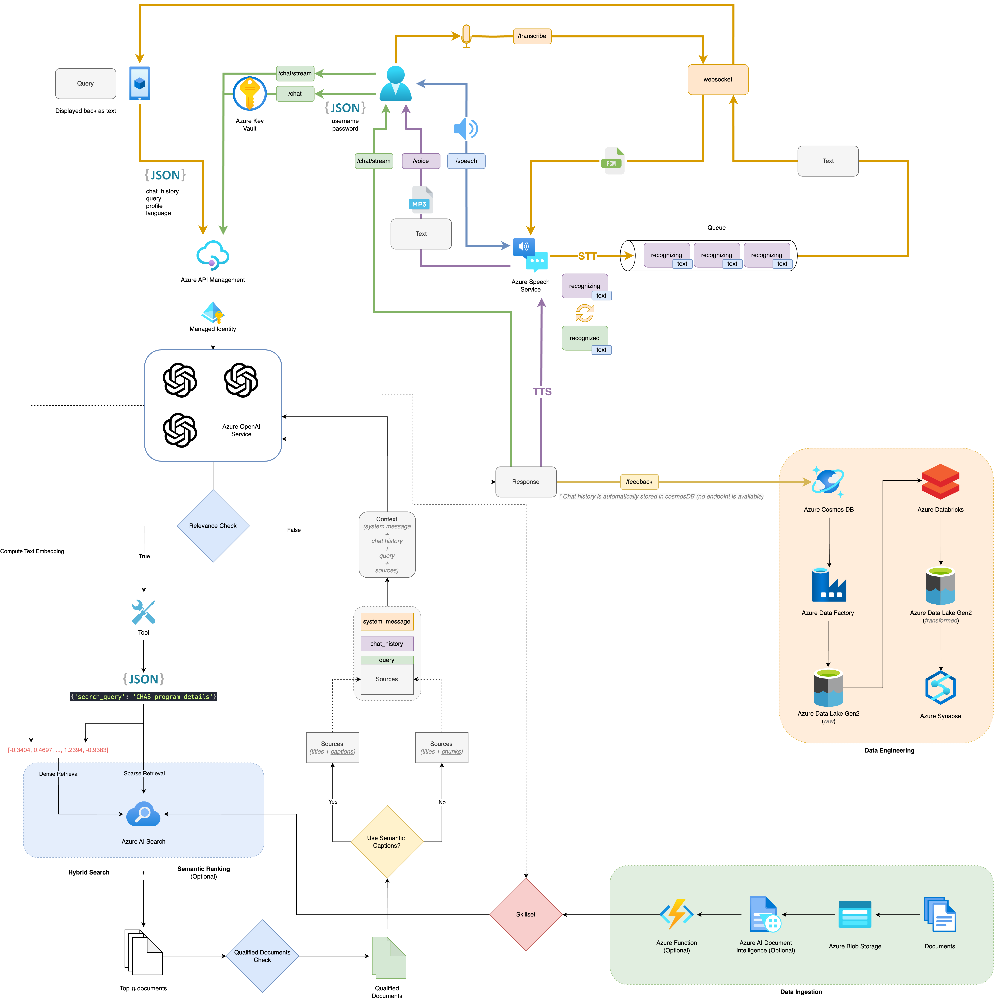

# Azure Conversational Assistant

## Table of Contents

- [Features](#features)
  - [Architecture Diagram](#architecture-diagram)
- [Getting Started](#getting-started)
  - [Local Environment](#local-environment)
- [Deploying](#deploying)
  - [Deploying Again](#deploying-again)
    - [Sharing Environments](#sharing-environments)
- [Running Locally](#running-locally)
- [Running Locally on Other Devices](#running-locally-on-other-devices)
- [Using the Deployed App](#using-the-deployed-app)
- [Install the Git Hook Scripts](#install-the-git-hook-scripts)
  - [(Optional) Run `pre-commit run --all-files`](#optional-run-pre-commit-run---all-files)
- [Workflow](#workflow)
  - [Data (Optional)](#data-optional)
  - [Contributing](#contributing)
  - [Dependency Updates](#dependency-updates)
- [Learning Resources](#learning-resources)

## Features <a id="features"></a>

- Chat (multi-turn) and Q&A (single turn) interfaces
- Renders citations and thought process for each answer
- Includes settings directly in the UI to tweak the behavior and experiment with options
- Integrates Azure AI Search for indexing and retrieval of documents, with support for [many document formats](/docs/data_ingestion.md#supported-document-formats) as well as [integrated vectorization](/docs/data_ingestion.md#overview-of-integrated-vectorization)
- Optional usage of [GPT-4 with vision](/docs/gpt4vision.md) to reason over image-heavy documents
- Optional addition of [speech input/output](/docs/deploy_features.md#enabling-speech-inputoutput) for accessibility
- Optional automation of [user login and data access](/docs/login_and_acl.md) via Microsoft Entra
- Performance tracing and monitoring with Application Insights
- Semantic Caching
- Quota Management

### Architecture Diagram <a id="architecture-diagram"></a>




## Getting Started <a id="getting-started"></a>

### Local Environment <a id="local-environment"></a>

1. Install the required tools:

   - [Azure Developer CLI](https://aka.ms/azure-dev/install)
   - [Python 3.10, or 3.11](https://www.python.org/downloads/)
     - **Important**: Python and the pip package manager must be in the path in Windows for the setup scripts to work.
     - **Important**: Ensure you can run `python --version` from console. On Ubuntu, you might need to run `sudo apt install python-is-python3` to link `python` to `python3`.
   - [Node.js 18+](https://nodejs.org/download/)
   - [Git](https://git-scm.com/downloads)
   - [Powershell 7+ (pwsh)](https://github.com/powershell/powershell) - For Windows users only.
     - **Important**: Ensure you can run `pwsh.exe` from a PowerShell terminal. If this fails, you likely need to upgrade PowerShell.

2. Create a new folder and switch to it in the terminal.

3. Git clone this repository.

## Deploying <a id="deploying"></a>

Follow these steps to provision Azure resources and deploy the application code:

1. Login to your Azure account:

   ```shell
   azd auth login
   ```

2. Create a new azd environment:

   ```shell
   azd env new
   ```

3. (Optional) This is the point where you can customize the deployment by setting environment variables, in order to [use existing resources](docs/deploy_existing.md), [enable optional features (such as auth or vision)](docs/deploy_features.md), or [deploy to free tiers](docs/deploy_lowcost.md).

4. Run `azd up` - This will provision Azure resources and deploy this sample to those resources, including building the search index based on the files found in the `./data` folder.

   - **Important**: Beware that the resources created by this command will incur immediate costs, primarily from the AI Search resource. These resources may accrue costs even if you interrupt the command before it is fully executed. You can run `azd down` or delete the resources manually to avoid unnecessary spending.
   - You will be prompted to select two locations, one for the majority of resources and one for the OpenAI resource, which is currently a short list. That location list is based on the [OpenAI model availability table](https://learn.microsoft.com/azure/cognitive-services/openai/concepts/models#model-summary-table-and-region-availability) and may become outdated as availability changes.

5. After the application has been successfully deployed you will see a URL printed to the console. Click that URL to interact with the application in your browser.
   It will look like the following:

   

> [!NOTE]
> It may take 5-10 minutes after you see 'SUCCESS' for the application to be fully deployed. If you see a "Python Developer" welcome screen or an error page, then wait a bit and refresh the page. See [guide on debugging App Service deployments](docs/appservice.md).

### Deploying Again <a id="deploying-again"></a>

If you've only changed the backend/frontend code in the `app` folder, then you don't need to re-provision the Azure resources. You can just run:

`azd deploy`

If you've changed the infrastructure files (`infra` folder or `azure.yaml`), then you'll need to re-provision the Azure resources. You can do that by running:

`azd up`

#### Sharing Environments <a id="sharing-environments"></a>

To give someone else access to a completely deployed and existing environment, either you or they can follow these steps:

1. Install the [Azure CLI](https://learn.microsoft.com/cli/azure/install-azure-cli)

2. Clone this repository.

3. Run `azd env refresh -e {environment name}`
   They will need the azd environment name, subscription ID, and location to run this command. You can find those values in your `.azure/{env name}/.env` file. This will populate their azd environment's `.env` file with all the settings needed to run the app locally.

   - Fill in the following information as below
     - Azure location: East Asia
     - `openAiAlternativeResourceGroupLocation`: East US
     - `openAiMainResourceGroupLocation`: East US 2
     - `password`/`username`/`secretKey`: Leave empty
       - Only fill these up if you are deploying
       - These are the secrets that are stored in the Azure Key Vault. You can get them from the Azure portal.

4. Set the environment variable `AZURE_PRINCIPAL_ID` either in that `.env` file or in the active shell to their Azure ID, which they can get with `az ad signed-in-user show`.

5. Run `./scripts/roles.ps1` or `./scripts/roles.sh` to assign all of the necessary roles to the user. If they do not have the necessary permission to create roles in the subscription, then you may need to run this script for them. Once the script runs, they should be able to run the app locally.

## Running Locally <a id="running-locally"></a>

You can only run locally if the deployment has been done previously. Otherwise, follow the [deploying](#deploying) steps above.

Ensure your .env file is correctly set up with the correct values before running. Otherwise, follow the [sharing environments](#sharing-environments) steps above.

1. Run `azd auth login`
2. Change dir to `app`
3. Run `./start.ps1` or `./start.sh` or run the "VS Code Task: Start App" to start the project locally.
4. The URL of the local server will be printed out.

See more tips in [the local development guide](docs/localdev.md).

> [!NOTE]
>
> Running `./start.ps1` or `./start.sh` runs via Quart Development Server. To emulate the production environment which uses Gunicorn server, run `make run-gunicorn`.

## Running Locally on Other Devices <a id="running-locally-on-other-devices"></a>

Ensure your .env file is correctly set up with the correct values before running. Otherwise, follow the [sharing environments](#sharing-environments) steps above.

To test the webapp locally on other devices in the same network, follow the steps below:

> [!WARNING]
>
> Ensure that you have installed openssl
>
> For MacOS, you can install openssl via `brew install openssl`
>
> For Windows, you can install openssl via `choco install openssl`

1. Navigate to the `app` folder
2. Run this command `make ssl-cert` or `openssl req -x509 -newkey rsa:4096 -keyout key.pem -out cert.pem -days 365 -nodes`
3. Fill up the information however you like
4. Run `./startwithssl.sh` or `./startwithssl.ps1`
5. Access the webapp via `https://{ipv4 address of the machine running the webapp}:50505`

> [!NOTE]
>
> To find ipv4 address of the machine, run `ipconfig` on Windows or `ifconfig` on Linux/MacOS

## Using the Deployed App <a id="using-the-deployed-app"></a>

- In Azure: navigate to the Azure WebApp deployed by `azd`. The URL is printed out when `azd` completes (as "Endpoint"), or you can find it in the Azure portal.

## Install the Git Hook Scripts <a id="install-the-git-hook-scripts"></a>

Run pre-commit install to set up the git hook scripts:

```zsh
pre-commit install

> pre-commit installed at .git/hooks/pre-commit
```

This command sets up the git hooks and run them automatically before every commit. For more information, refer to the [pre-commit docs](https://pre-commit.com/). To see what hooks are used, refer to the [`.pre-commit-config.yaml`](.pre-commit-config.yaml) YAML file.

### (Optional) Run `pre-commit run --all-files` <a id="optional-run-pre-commit-run---all-files"></a>

Optionally, you can also run the command `pre-commit run --all-files` to lint and reformat your code. It's usually a good idea to run the hooks against all of the files when adding new hooks (usually pre-commit will only run on the changed files during git hooks).

Alternatively, there is a [`Makefile`](app/Makefile) that can also lint and reformat your code base when you run the simpler command `make lint`.

You should ensure that all cases are satisfied before you push to GitHub (you should see that all has passed). If not, please debug accordingly or your pull request may be rejected and closed.

The [`run-checks.yml`](.github/workflows/run-checks.yml) is a GitHub workflow that kicks off several GitHub Actions when a pull request is made. These GitHub Actions check that your code have been properly linted and formatted before it is passed for review. Once all actions have passed and the PR approved, your changes will be merged to the `main` branch.

> [!NOTE]
> The `pre-commit` will run regardless if you forget to explicitly call it. Nonetheless, it is recommended to call it explicitly so you can make any necessary changes in advanced.

## Workflow <a id="workflow"></a>

> [!NOTE]
> Before making any commits/PR, ensure that you have setup [pre-commit](#install-the-git-hook-scripts) and passed all the checks.

### Data (Optional) <a id="data-optional"></a>

Output data from our [pipeline](https://github.com/0Upjh80d/healthhub-content-optimization/tree/main/content-optimization) is versioned controlled and stored in a remote repository — Azure Storage Account.

> [!IMPORTANT]
> These data are indexed and ingested into the Azure AI Search index. If this has been done previously, you may skip this section entirely.

When `azd provision` or `azd up` is ran, a script will be kicked off postprovision of the Azure resources. This script will upload the data — in a `data/` folder — to the Azure Storage Account and will index the data in the Azure AI Search index.

To ensure that the data is available for ingestion, follow the steps below:

1. Create a `.env` file from [`.env.sample`](.env.sample) and fill in the environment variables. It should look like the folllowing:

   ```yaml
   AZURE_STORAGE_ACCOUNT=
   AZURE_KEY_VAULT=
   AZURE_URL_PRIMARY=
   SECRET_NAME_PRIMARY=
   ```

2. Sparse checkout the `.dvc` files from the [pipeline repository](https://github.com/0Upjh80d/healthhub-content-optimization/tree/main/content-optimization). These `.dvc` files point to the data files in the Azure Storage Account.

- For Linux or macOS users, run:

  ```bash
  ./scripts/sparse_checkout.sh
  ```

- For Windows users, run:

  ```powershell
  ./scripts/sparse_checkout.ps1
  ```

3. Then, run the following command to set up the DVC configurations:

- For Linux or macOS users, run:

  ```bash
  ./scripts/setup_dvc.sh
  ```

- For Windows users, run:

  ```powershell
  ./scripts/setup_dvc.ps1
  ```

4. Lastly, run the following command to get the latest version of the pipeline data for ingestion:

- For Linux or macOS users, run:

  ```bash
  ./scripts/get_data.sh
  ```

- For Windows users, run:

  ```powershell
  ./scripts/get_data.ps1
  ```

> [!TIP]
> For more information on data versioning control, you may refer to the section in the `README` [here](https://technical-docs-ddfre4b9ebbbaza8.scm.southeastasia-01.azurewebsites.net/wwwroot/site/projects/genai/health-hub/data-pipeline/).

### Contributing <a id="contributing"></a>

1. Any code changes for **Frontend**, **Backend** and **Prompt** must be PR'd to the `staging` branch instead of `main`.
2. Ensure `staging` branch is stable before creating a PR to `main`.

### Dependency Updates <a id="dependency-updates"></a>

1. Test the dependency updates requested by `dependabot` locally first.
2. If the updates are successful, create a PR with the changes to the `staging` branch.
3. Close the PR made by `dependabot` and tag it with your new PR.

> [!NOTE]
>
> 1. If updates are not possible due to dependency conflicts, add the dependency name to [`dependabot.yml`](.github/dependabot.yml) under `ignore` section.
> 2. Create a PR to `staging` branch.
> 3. Close the PR made by `dependabot` and tag it with your new PR.

## Learning Resources <a id="learning-resources"></a>

1. [`azure_ai_search.ipynb`](notebooks/azure_ai_search.ipynb): Learning resource to understand how Azure AI Search is created, managed and utilized.
