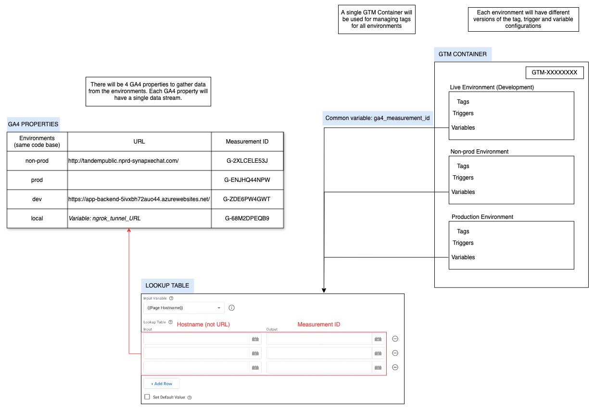

# Frontend Analytics Documentation

## Introduction

Google Tag Manager (GTM) is used for tag management and captures event data on the website when users interact with it. This data is then sent to Google Analytics 4 (GA4), which processes it and provides useful analysis and reports.

## Table of Contents

1. [Prerequisites](#prerequisites)
2. [Setting Up GTM](#setting-up-gtm)
3. [Setting Up GA4](#setting-up-ga4)
4. [Environments Configuration](#environments-configuration)
5. [Integrating GTM with GA4](#integrating-gtm-with-ga4)
6. [Adding New Events in GTM](#adding-new-events-in-gtm)
7. [Testing and Debugging](#testing-and-debugging)
8. [Creating and Retrieving Reports in GA4](#creating-and-retrieving-reports-in-ga4)
9. [Troubleshooting Guide](#troubleshooting-guide)
10. [GTM Glossary](#gtm-glossary)
11. [GA4 Glossary](#ga4-glossary)

## Prerequisites

- Access to HH AI google account

## Setting Up GTM

### Create a GTM Account and Container

1. Go to [Google Tag Manager](https://tagmanager.google.com/)
2. Click **Create Account** and enter:
   - Account Name: (e.g., HH AI 2)
   - Country: `Singapore`
   - Container Name: (can be anything, doesn't have to be url)
   - Target Platform: `Web`
3. Click **Create** and accept the Terms of Service.
   > Note: 1 GTM Account can have multiple containers. But, 1 GTM container is sufficient for 1 website.

### Install GTM on Website

1. GTM provides a container snippet consisting of two code blocks.
2. Place the first snippet right at the start of the `<head>` section of the `index.html` file.
3. Place the second snippet immediately after the opening `<body>` tag.
   > Note: The snippets should be installed on all pages of the website. But since this is a SPA, just installing on the main `index.html` file is sufficient.

### Publish the GTM Container

1. In GTM, click **Submit**.
2. Provide a version name, e.g., `Initial Setup`.
3. Click **Publish** to make the container live.

## Setting Up GA4

### Create a GA4 Property

1. Go to [Google Analytics](https://analytics.google.com/analytics/web/).
2. Click **Admin** > **Create Property**.
3. Enter the property name, e.g., `HH AI - Prod 2`.
4. Set the reporting time zone and currency.
5. Click **Next** and complete the business information.

### Set Up a Data Stream

1. Within the new property, go to **Data Streams**.
2. Select **Web** and enter the website URL and stream name.
3. Enable **Enhanced Measurement** to automatically track common events, but disable `scrolls` and `form interactions` within enhanced measurement settings (as they don't work properly).
4. Click **Create Stream**.

### Retrieve the Measurement ID

1. After creating the data stream, note the **Measurement ID** (formatted as `G-XXXXXXXXXX`).

## Environments Configuration

To perform data collection across different environments (e.g., development, staging, production), we will use the `Environments` feature on GTM, and different GA4 properties (each with a single data stream) for each environment.

### 1. Create GTM Environments

1. **Access GTM Admin Panel**:

   - Log in to [Google Tag Manager](https://tagmanager.google.com/).
   - Navigate to working container.
   - Click on **Admin**.

2. **Define Environments**:

   - Under the **Container** column, select **Environments**.
   - Click **New** to create a new environment.
   - Enter a name (e.g. `Production`) and an optional description.
   - **Enable debugging by default**: Activates GTM's debug mode for this environment.
   - Click **Create Environment**.
     > Note: Currently, `Live` is used for development, so no specific environment is created for it.

3. **Deploying for different environments**:
   - After creating an environment, click on the **Actions** dropdown next to it and select **Get Snippet**.
   - GTM will provide environment-specific container snippets.
   - **(Important)** Replace the standard GTM container snippets with the environment-specific snippets when deploying for different environments (replace the `index.html` file).

> Note: The standard snippet installed in the codebase is used for development.

### 2. Configure GA4 Measurement ID Based on Environment

To direct data to the appropriate GA4 property based on the environment:

- Create a new variable in GTM named `ga4_measurement_id`.
- Select **Lookup Table** as the variable type.
- Set the **Input Variable** to `{{Page Hostname}}`.
- For each environment, set the corresponding **page hostname** as the input, and **Measurement ID** variable for each data stream as the output (which we noted earlier).

### 3. Setting up local environment

The majority of testing will be done via the local environment, as we need a quick way to test whether the changes made in the code actually allows for tracking.

- Install [ngrok](https://ngrok.com/) if you don't already have it installed. (Make sure you are aware of potential [risks](https://www.huntress.com/blog/abusing-ngrok-hackers-at-the-end-of-the-tunnel) associated with using ngrok for tunneling).
- Run the HH AI app and expose whichever port it is running on via the command: `ngrok http <port>`
- Get the **forwarding link** and update the `ngrok_tunnel_url` variable.
- For testing on GTM, just add the **forwarding link** to the list of domains on Tag Assistant.

## Custom variables

### 1. Configuration settings

To allow for tracking of the website when loaded into other websites via an iframe, we need to modify the cookie configurations:

- Create a new variable called `configuration_settings`
- Select **Google Tag: Configuration Settings** as the variable type
- Set the Config Parameter to `cookie_flags`, and the value as **SameSite=None;Secure**
  > Note: The `configuration_settings` variable can be used to add additional configuration to the Google Tag, which we will create later.

### 2. Event settings

With an event settings variable, we can configure a list of event parameters (and settings) and apply them to multiple tags. We will use this to create a `page_type` variable that will be used to send the type of the page that the user is on (either `voice` or `text`) for all the events.

- Create a new variable called `event_settings`.
- Select **Google Tag: Event Settings** as the variable type.
- Define **Event Parameters**: this will be inherited by all event tags that reference this variable. In this case, set up `page_type` as the Event Parameter.

## Integrating GTM with GA4

To link GTM with GA4, we neet to configure the **Google Tag** in GTM

1. **Create a New Tag**:
   - Navigate to **Tags** > **New** and create new tag called `ga4_initialization`.
   - Click on **Tag Configuration** and select `Google Tag` as the tag type.

- **Enter Tag ID**: Here, select the `ga4_measurement_id` we created earlier.
- **Configuration Settings**: Set the Configuration Settings Variable to the `configuration_settings` variable we created earlier.
- **Shared Event Settings**: Set the Event Settings Variable to the `event_settings` variable we created earlier.
- **Set Triggering**: Click on **Triggering** and choose the **All Pages** trigger to ensure the tag fires on every page load.

## Adding New Events in GTM

To track user interactions, we need to configure both **tags** and **triggers** in GTM. Every event requires a properly structured tag and an associated trigger to fire it under the right conditions.

### Naming convention

Currently, every event, tag and trigger associated with a particular user interaction will have the same name, for standardization. Follow the below naming convention and ensure uniqueness:

- Format: `[Category]_[Action]_[Details]`
- **Category**: The section of the website (e.g., `header`, `sidebar`, `voice`, `text`, `common`).
- **Action**: The type of interaction (e.g., `click`, `view`).
- **Details**: Additional details (e.g., `copy`, `send_question`).
- Example: `sidebar_click_copy`

### Configuring Tags

To create a new event tracking tag in GTM, follow these steps:

1. **Navigate to Tags**: In GTM, go to **Tags** > **New**. Follow naming convention for Tag name.
2. **Set Tag Type**: Click on **Tag Configuration** and select **Google Analytics: GA4 Event**.
3. **Set Measurement ID**: Use the `ga4_measurement_id` variable we created earlier.
4. **Define Event Name**: Follow naming convention
5. **Add Event Parameters**:
   - Set the Event Settings Variable to the `event_settings` variable we created earlier.
   - If additional information is needed for the event (e.g., `link_url`), click **Add parameter** and configure it here.
6. **Assign Trigger**: Choose the appropriate trigger (created in the next step) to determine when the event fires.

### Configuring Triggers

Triggers define when an event should be recorded. Each tag must have an associated trigger.

1. **Navigate to Triggers**: In GTM, go to **Triggers** > **New**. Follow naming convention for Trigger name.
2. **Set Trigger Type**: Click **Trigger Configuration** and choose an appropriate type (e.g., `Click - All Elements`, `Element Visibility`).
3. **Define Trigger Conditions**: Specify when the trigger should fire (e.g., when a button with a specific class is clicked).
4. **Save and Assign to Tag**: Once created, assign the trigger to the appropriate tag.

## Testing and Debugging

Ensuring that the newly created tags and triggers work correctly is crucial for accurate data collection.

### 1. Use GTM's Preview Mode

- **Enter Preview Mode**: In GTM workspace, click on the **Preview** button. Enter the website URL and click **Connect**. This will open the site in debug mode. An iframe will pop up to indicate that the debug session is active (make sure this is visible before proceeding! If not, clear the cache and try again)

- **Verify Tag Firing**: Interact with your website as a user would. The **Tag Assistant** pane will display which tags fire on each interaction. Ensure that your tags fire as expected.

### 2. Verify in GA4 DebugView

- **Access DebugView**: In GA4, navigate to **Admin** > **DebugView**.

- **Perform Test Interactions**: While the site is in GTM's preview mode, perform the interactions you've set up to track (e.g., clicking the signup button).

- **Confirm Event Logging**: In DebugView, verify that the events and data appear as expected.

## GTM Version Control and Publishing

**After testing and debugging** newly created tags and triggers, follow these steps to properly version and publish updates.

### 1. Creating and Managing Versions

- Before publishing any updates, always create a new version.
- Clearly describe what changes were made (e.g., `Added Signup Button Click Tracking`).
- Each version logs changes, making it easy to review past updates.

### 2. Publishing Changes

- In GTM, navigate to **Admin** > **Environments** and choose the appropriate environment.
  > Note: **Live** is used for development.
- Go to **Versions**, select the desired version and click **Submit**
- Provide a brief description of the changes, and publish to the selected environment.

### 3. Rolling Back Changes

- If an issue is detected, revert to a previous working version by:
  - Go to **Versions** > Choose a previous version > Click the more options icon > Click **Publish to**.
  - Select the environment for which you want to rollback changes
  - Click **Publish**

## Creating Custom Dimensions on GA4

If custom event parameters are sent over with events via GTM, you need to register them under custom dimensions in GA4 in order to be able to use them. We will do this for the `page_type` variable.

- In GA4, click on **Admin** in the left-hand menu > Admin > Custom Definitions (under Data Display)
- Click **Create custom dimension**. Set appropriate dimension name, scope, description.
- Under **Event parameter**, select the variable which we want to register as a custom dimension on GA4.
- Select `page_type` and click **save**.

> Note: There will be a 1-2 day delay between when custom variables are sent over with the data to GA4 from GTM and another 1-2 day delay to be able to use the custom dimension in GA4 reports after creating them.

## Creating and Retrieving Reports in GA4

### Standard Reports

Standard reports are provided by GA4 by default, and can be scheduled to be automatically sent over via email.

1. **Dashboard report**
   - In GA4, click on **Reports** in the left-hand menu > Reports Snapshot.
   - This shows an overview of various metrics automatically tracked by GA4 like `Active users by Browser`.
   - This can be customized to include other cards.
2. **Key Events Graph**
   - In GA4, click on **Reports** in the left-hand menu > View user engagement & retention > Events.
   - By default, this shows the `Event Count` of **all** the events over time.
   - Plot only the key events and export the graph as pdf

### Custom Reports

To access the custom reports:

- Click on **Explore** in the left-hand menu. You will see the list of reports.
- To export the reports, click on any of them, then click on the `export` button in the top right.

> For more information on how to create new custom reports, click [here](https://support.google.com/analytics/answer/7579450?hl=en#zippy=%2Cin-this-article).

## Troubleshooting Guide

### No Data in GA4 property

- Check that the correct Measurement ID and domain is entered in the `ga4_measurement_id` variable.

- Confirm that the `Google Tag` is published in GTM and that the GTM container is correctly implemented on the website.

### Tags Not Firing

- Ensure that triggers are correctly set up and assigned to the appropriate tags.

## GTM Glossary

| Term            | Definition                                                                                                                                                                                                                                                                                                                                  |
| --------------- | ------------------------------------------------------------------------------------------------------------------------------------------------------------------------------------------------------------------------------------------------------------------------------------------------------------------------------------------- |
| Container       | A container is a basic unit in GTM. It holds all the tags, triggers, and variables for a particular website.                                                                                                                                                                                                                                |
| Event           | An event allows you to measure a specific interaction or occurrence on the website. For example, you can use an event to measure when someone loads a page or clicks a link.                                                                                                                                                                |
| Event parameter | A key-value pair (e.g.,'currency': 'USD') that provides additional information about events. For example, when someone adds a product to a shopping cart, the Google tag sends an add_to_cart event. To get more detailed data on the item, you can encode parameters for that event, such as the product name, and price.                  |
| Tags            | Tags are snippets of code that track specific user actions or events. This performs the data collection.                                                                                                                                                                                                                                    |
| Triggers        | Tags fire based on events. Triggers are used to listen for these events, and they govern when a tag is fired or blocked.                                                                                                                                                                                                                    |
| Variables       | A variable is a placeholder that stores a value that can be used by a tag or trigger.                                                                                                                                                                                                                                                       |
| Version         | The version of a container refers to the current configuration of the container. That includes all the tags, triggers, and variables. Every time you make changes to the container, a new version is created. You can publish new versions to make changes live on the website. Also, it can be reverted to previous versions if necessary. |

## GA4 Glossary

| Term                 | Definition                                                                                                                                                                                                                                        |
| -------------------- | ------------------------------------------------------------------------------------------------------------------------------------------------------------------------------------------------------------------------------------------------- |
| Property             | A property represents a grouping of data from a website in Google Analytics. Within a property, you can view reports and manage data collection, attribution, privacy settings, and product links. An account can contain one or more properties. |
| Measurement ID       | A unique identifier for a web data stream (which is a website registered within Google Analytics).                                                                                                                                                |
| Key Event            | A key event is an event that measures an action that's deemed as particularly important to us. Any event can be marked as a key event.                                                                                                            |
| Data Stream          | A flow of data from a website to a GA4 property                                                                                                                                                                                                   |
| Enhanced Measurement | A GA4 feature that automatically tracks common user interactions without additional tagging.                                                                                                                                                      |
