# Azure Load Testing

## Using JMeter GUI: JMeter Load Testing Script Generation Tool

This repository now includes an example of load testing files, `chat_stream.jmx`, `users.properties` and `queries.CSV`; which can be given as input to the Azure Load Testing Service. The rest of this documentation will focus on the use of JMeter Tool to generate the JMX file. Refer to the documentations listed here instead for more about how to use these files on the Azure Load Testing Service:

- [Uploading .jmx file to Azure Load Testing](https://learn.microsoft.com/azure/load-testing/how-to-create-and-run-load-test-with-jmeter-script?tabs=portal)
- [Creating and uploading the .properties file to Azure (for setting params dynamically)](https://learn.microsoft.com/azure/load-testing/how-to-configure-user-properties?source=recommendations&tabs=portal)
- [Uploading CSV file to Azure for load testing samples](https://learn.microsoft.com/azure/load-testing/how-to-read-csv-data?source=recommendations&tabs=portal)

## Table of Contents

1. [Feature Overview](#feature-overview)
2. [Getting Started](#getting-started)
   1. [Prerequisites](#prerequisites)
   2. [Setting up and Usage](#setup-and-usage)
      - [Launching JMeter GUI](#launching-jmeter-gui)
      - [Add Custom Thread Groups Plugin to JMeter](#adding-custom-thread-groups-plug-in-to-jmeter)
      - [Setting Up Thread Group](#setting-up-thread-group)
      - [Setting HTTP Request Sampler](#add-http-request-sampler-element-for-testing-endpoint)
      - [Setting Config Elements (CSV Data Set and HTTP Header Manager)](#add-csv-data-set-and-http-header-manager-config-elements)
      - [Setting Up Random Uniform Timer](#adding-random-think-time-and-constant-delay)

## Feature Overview

- **More Load Testing Samples:** Using Azure URL test, only 5 samples are repeatedly used for load test. Using a custom generated JMX file allows one to input a CSV file of sample queries to add variety to load test samples, to better simulate actual usage of the application.
- **Simple Set-up with GUI:** Graphical user interface makes creation of script simpler, as compared to manually modifying script.
- **Granular Control of Load Testing Scenario:** Basic load testing (from Azure URL test) only allows for simple scenario where load slowly increases to peak and maintains for a specified period of time. Using JMeter GUI (together with **_Custom Thread Groups_** plugin) provides more flexibility and granular control of the load amount over time for more advanced tests (e.g. simulating spikes in usage).
- **Comparison between JMeter and Locust:** Locust may produce more realistic results for highly concurrent systems where asynchronous user actions (e.g., idle time between requests) dominate.
  JMeter may be more realistic for applications where thread-based simulation mirrors actual user sessions (e.g., users with distinct states and resources). We believe this mimicks our application use better, since users will be using different devices in the real-world usage. We hence decided to go with JMeter to simulate load on our application.

## Getting Started

### Prerequisites

- Download JMeter GUI from [this link](https://dlcdn.apache.org//jmeter/binaries/apache-jmeter-5.6.3.zip) (Note: link is for current latest version, v5.6.3. Subsequent steps should be similar for similar versions)
- Unzip the contents of downloaded file
- Download JMeter plugin manager from [this link](https://jmeter-plugins.org/get/). Download it into the `/apache-jmeter-5.6.3/lib/ext` directory of the unzipped JMeter folder.

### Setup and Usage

This tutorial will walkthrough creating a JMeter Load Test for the chat/stream endpoint for the application. For testing other endpoints, steps would be similar, just change the HTTP path.

#### **Launching JMeter GUI:**

In your command line, enter the directory `/apache-jmeter-5.6.3/bin`.
Run `jmeter.bat`.

#### **Adding 'Custom Thread Groups' plug-in to JMeter:**

- Click the **Options** dropdown > **plugin manager** > **Available Plugins**
- In the text box, search **Custom Thread Groups** and check the box. Click **Apply Changes and Restart** button on the bottom right.

  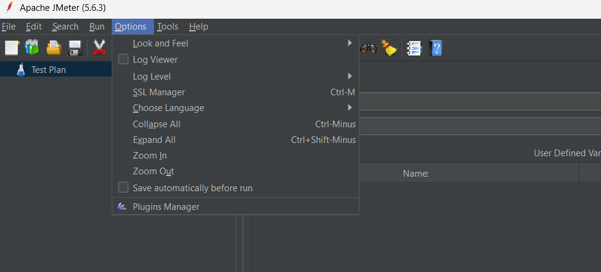
  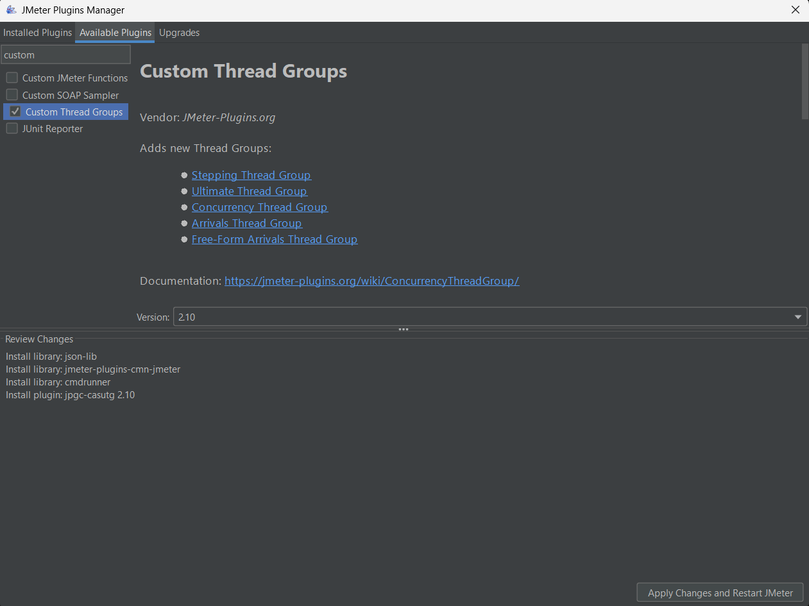

#### **Setting up Thread Group:**

- On the left banner, right click **Test Plan**, and go to: **Add** > **Threads (users)** > **jp@gc - Ultimate Thread Group**. You will see the interface to set test parameters.

> [!NOTE]
> There are many ways of defining custom thread loads, using the different types of thread groups. We use **jp@gc - Ultimate Thread Group** here because it provides the most flexibility. Refer to this [documentation](https://www.blazemeter.com/blog/jmeter-thread-group#ultimate-thread-group) for more about each thread group avialable in the plugin.

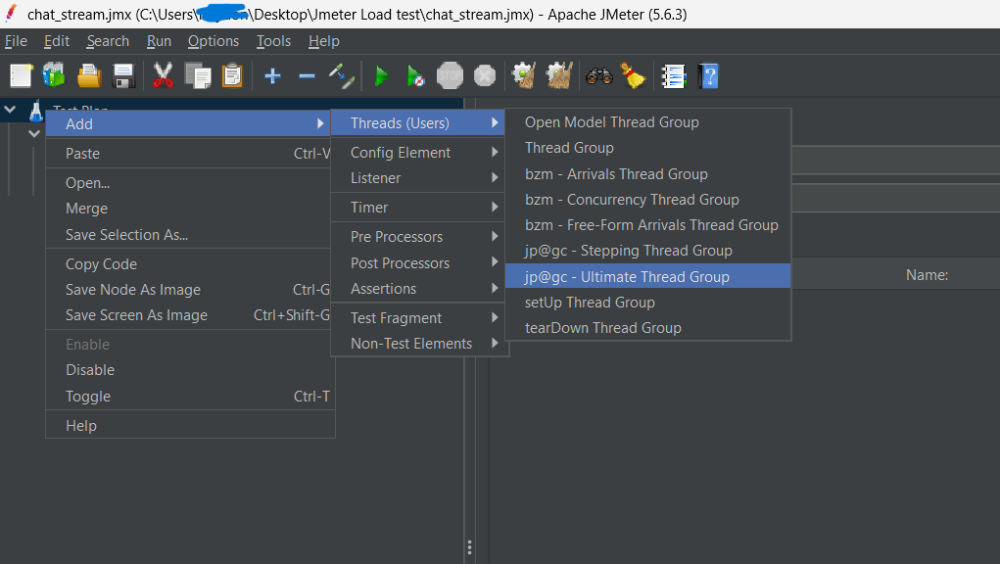

- Use `${__P(paramName, defaultValue)}` to set parameter values (allows dynamic adjustment using .properties file later). See screenshot below for example.

  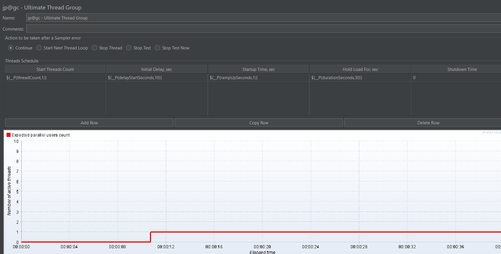

- The params in the image above are as follows:

  - **Start Threads Count:** Number of users in load test
  - **Initial Delay, sec:** Wait time before load start coming in (warmup for the app)
  - **Startup Time, sec:** Time for load to increase to Thread Count value from 0
  - **Shutdown Time** Time taken for load to decrease back to 0 from Thread Count value at end of test.

> [!TIP]
> Adjust the values to see how the graph changes, and if it represents the load test scenario you want. Use additional rows to create other load patterns. e.g. spikes

- While the default JMeter thread group control allows you to set LoopController values (determines number of times test is ran, or whether to run forever etc.); when using this plugin, LoopController is set for test to occur once only, and end when stop condition or test duration completes.

#### **Add 'HTTP Request' Sampler element for testing endpoint:**

- On the left banner, right click the thread group you just created (defualt name is 'jp@gc - Ultimate Thread Group') and go to: **Add** > **Sampler** > **HTTP Request**.

  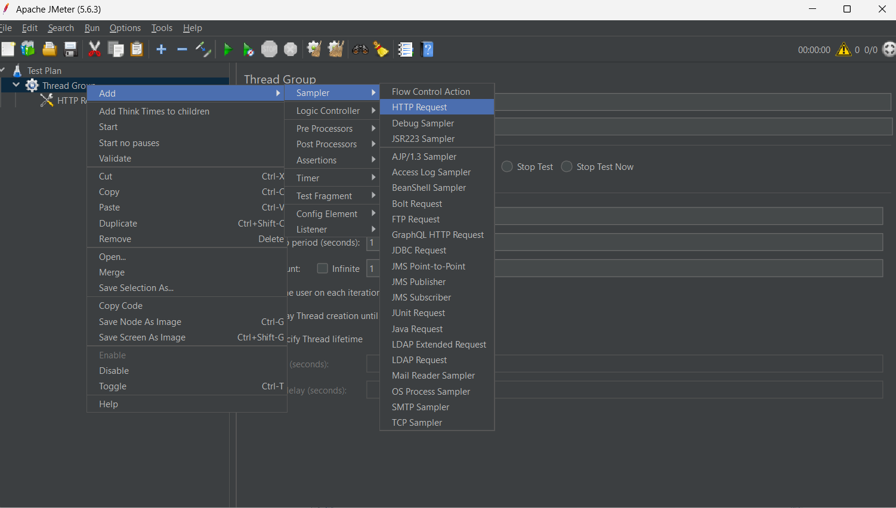

- Set **HTTP Request** to POST and set **Path** to `${__P(endpointRoute, healthhub/chat/stream)}`.
  Under **Body Data**, input request json with dynamic variable values for json fields with `${variable_name}`. See screenshot below for example.

  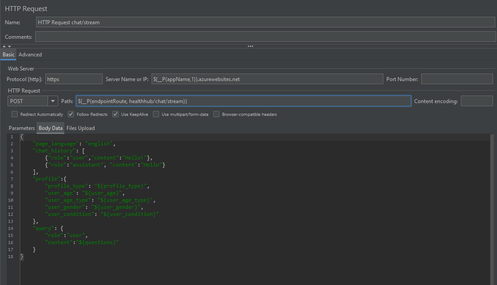

##### **Add CSV Data Set and HTTP Header Manager Config elements:**

- Click to **Add** > **Config Element** > **CSV Data Set Config**. The CSV config element should be added.
- Click to **Add** > **Config Element** > **HTTP Header Manager**. The HTTP Header Manager config element should be added.

  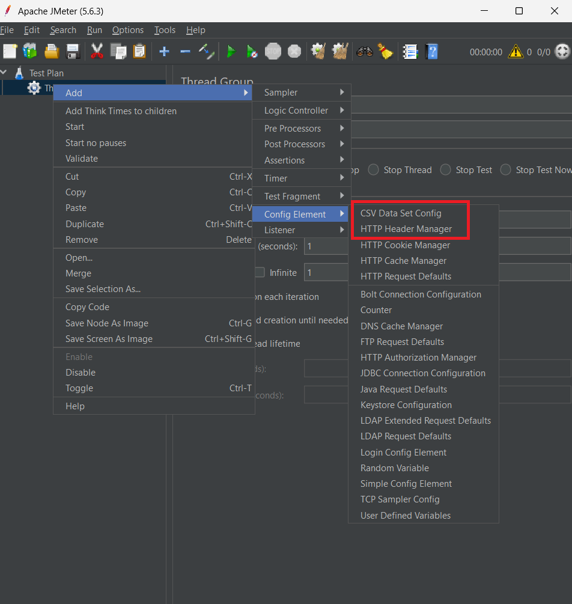

- If using more than one test engine, it may be beneficial to split the CSV evenly over the engines. To do so, CSV has to come without headers, and variable names have to be set in the **CSV Data Set Config** in JMeter. The example screenshot below shows configuration if headers are not present.

> [!NOTE]
> Variable names should follow order in CSV file.

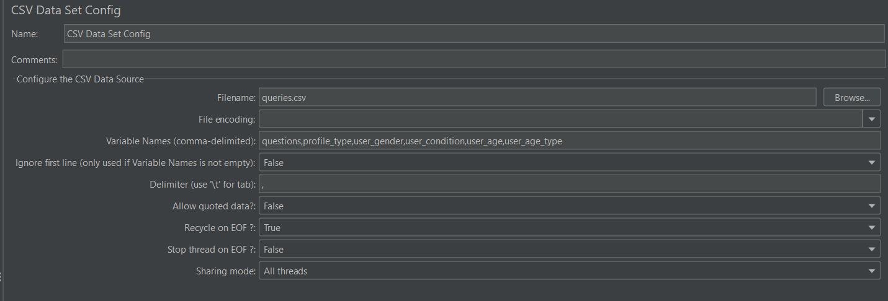

- Next, under **HTTP Header Manager**, add a row and input the `content-type` header as shown in the screenshot below.

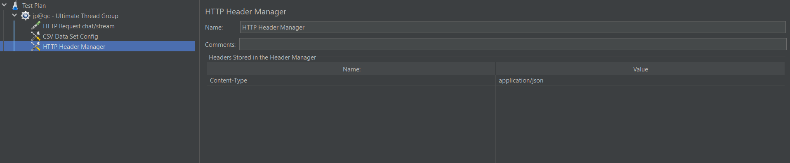

#### **Adding Random Think Time and Constant Delay**

- To make load testing more realistic, a thinking time delay can be added to simulate users pausing to think before making queries. This is done using **Timers** in JMeter. Right click the thread group, then click **Add** > **Timer** > **Uniform Random Timer**. A timer element should be added.

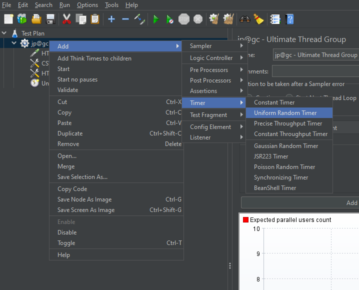

- **Random Delay Maximum** defines specifies the upper limit for a random delay generated for each query, while **Constant Delay Offset** specifies a fixed for every query. So actual delay is = random delay value (0 - Max random delay) + constant delay. We can use dynamic variables like before for this settings, see screenshot below for example.

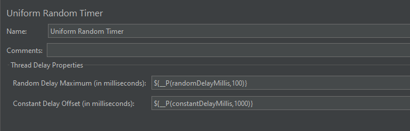
