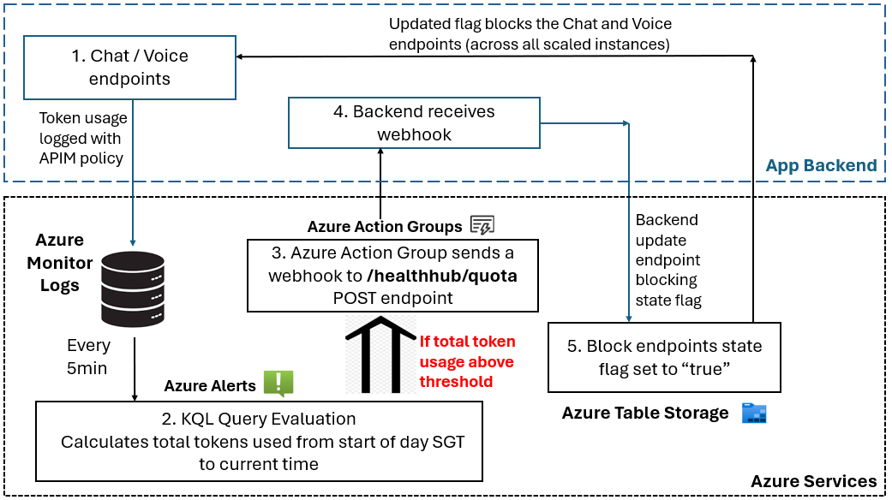
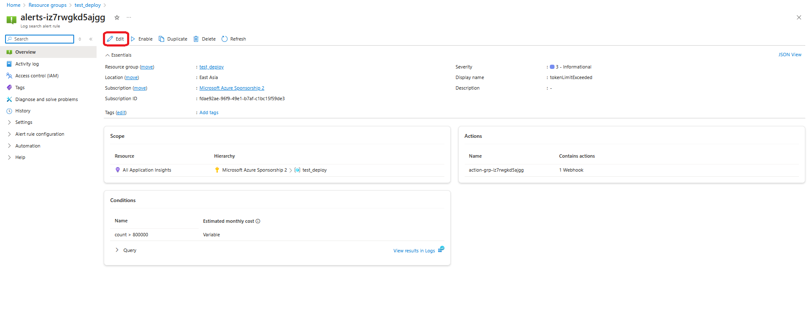
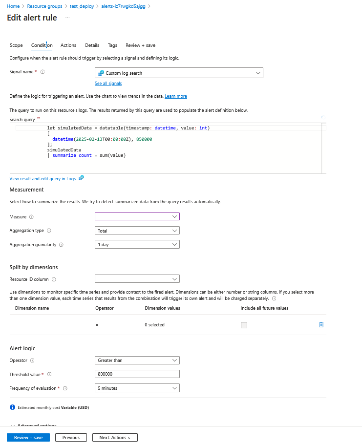
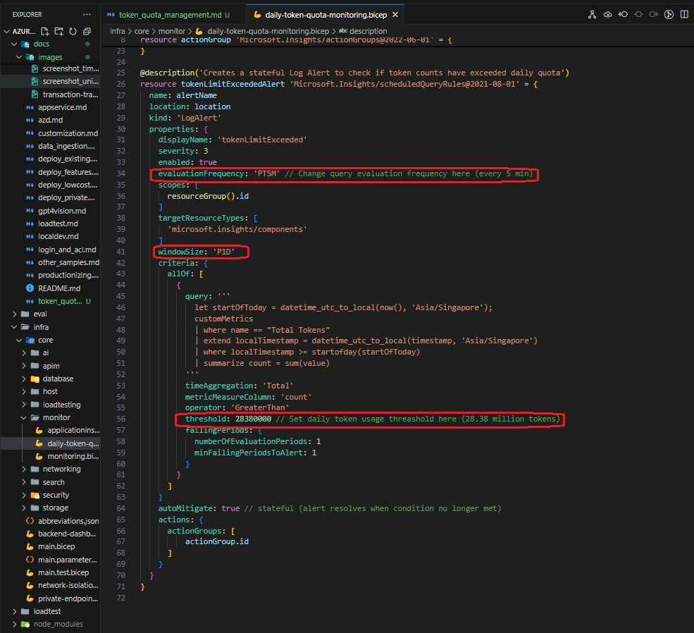

# Azure OpenAI Token Quota Management

## Table of Contents

1. [Overview](#overview)
2. [Achitecture and flow](#achitecture-and-flow)
3. [Design Choices](#design-choices)
4. [Toggling Azure Alert Settings](#toggling-azure-alert-settings)
   1. [Setting up and Usage](#setup-and-usage)
      - [Via Azure Portal](#via-azure-portal)
      - [Via Bicep Code](#via-bicep-code)
5. [Possible Future Work](#possible-future-work)

## Overview

When the application is deployed in production or during user testing, a measure has to be in place to control the daily LLM token usage to keep costs within budget. This is enforced within the backend of the application and with the use of some Azure cloud services, such as Azure Alerts, Action Groups and Table Storage. This documentation will explain the process and the methods used to create this feature.

## Achitecture and flow

1. When `Chat` / `Voice` endpoints are called, it first checks the state flag stored in the table `LLMUsage`, in **Azure Table Storage**. This value is `'false'` when the quota is not yet exceeded, and the endpoints will proceed with the call if this is so. Token usage is logged into **Azure Monitor Logs** by the `azure-openai-emit-token-metric` policy in **Azure APIM**.
2. Every 5 minutes, **Azure Alert** will run a KQL query to evaluate if quota threshold has been hit for the day (interval and threshold can be configured).
3. If hit, **Azure Alert** triggers an **Azure Action Group** which sends a webhook to the webhook receiver endpoint in the application backend.
4. The POST endpoint `healthhub/quota` receives the webhook which triggers the backend to update the state flag in the **Azure Table Storage** to be `'true'`.
5. This updated flag effectively blocks all future requests on the `Voice` and `Chat` endpoints for the day. The state is reset at start of the day (12 midnight SGT) by a scheduled Cron Job that runs in `app.py`. (See `reset_daily_token_quota` function)

## Design Choices

Since token usage is stored in **Application Insights** logs, **Azure Alerts** is used to run KQL queries on the logs and have a log based alert rule that checks if usage exceeded the set threshold.

**Azure App Services** creates multiple instances of the deployed application for scaling purposes, hence a centralised state flag is requried for all instances to refer to. This is stored on **Azure Table Storage**, which is cheaper as compared to **Redis Cache** and **Azure App configuration** services. This method also runs a centralised threshold evaluation, which is a better option as compared to making KQL queries every time the endpoints are called from each instance.

Using a webhook receiver endpoint in the backend is also a better alternative for this instead of constantly making GET requests to check logs if the threshold is exceeded.

Finally, the alert is set to automatically resolve when threshold is no longer exceeded (i.e. the quota is reset for a new day).

## Toggling Azure Alert Settings

### Setup and Usage

This part of the documentation will walkthrough how to modify the settings after provisioning the services on Azure cloud. The service that may require modifications is **Azure Alerts**.

#### Via Azure Portal

After deployment, you can locate the **Azure Alert** resource from Azure **Resource Groups**. The **Overview** page for the resource instance is shown in the screenshot below:

At the bottom of **Overview**, we can see the **Conditions** window, which indicates the threshold condition for alert to be fired, and the evaluation KQL query to check the threshold. Under the **Actions** window, you can see the action group that will be triggered when alert is fired.

To modify any of these settings, click on the **Edit** button circled in red. You should see the screen below:

The query, threshold, evaluation frequency and aggregation period (aggregate over what window) can be changed as required from here. Note that **Scope** here refers to the scope to which the logs exists. The logs in this case are from the **Application Insights** resource of the resource group.

#### Via Bicep Code

To change settings for every deployment onwards, changes to the bicep code is required. The Azure Alert resources for quota management are all defined in the bicep module located in the `infra/core/monitor/daily-token-quota-monitoring.bicep` file. In the screenshot below, you can see the parameters to change the evaluation parameters witin the bicep code (threshold and interval parameters annotated below):

> [!NOTE]
> Highest frequency of evaluation is every 5 minutes for an aggregate window of 1 day. Higher frequency will incur higher costs (USD$1.5 per month for current evaluation settings).

## Possible Future Work

Azure Alerts does not have a built in capability to trigger action groups when alert is resolved. Hence workarounds are required to reset the quota flag every day. Current implementation uses a Cron job to reset the state in Table Storage. Should there be issues with this in non-prod environment, we could explore two alternatives:

1. Use **Azure Logic App** to trigger another Action group to reset flag at midnight daily. This avoids using backend to reset the state entirely.
2. KQL query every time chat/voice endpoints are called. May cause more latency and costs.
